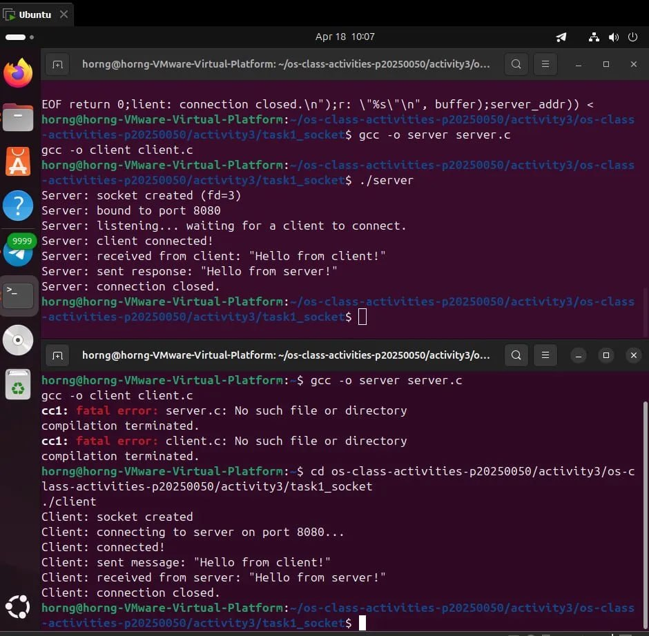
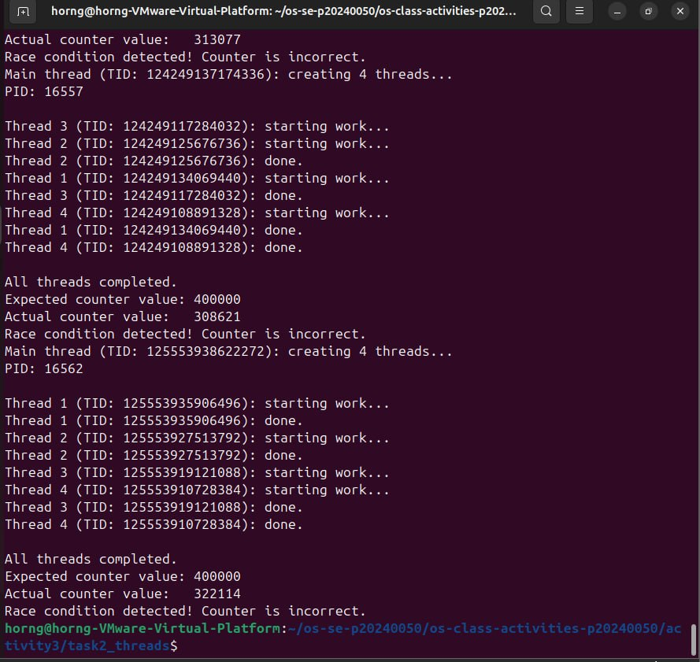
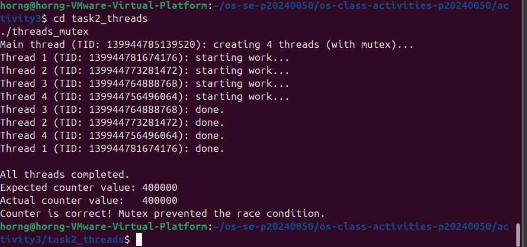
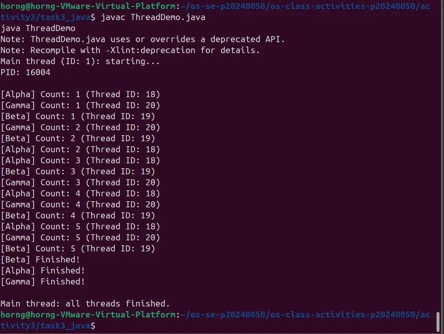
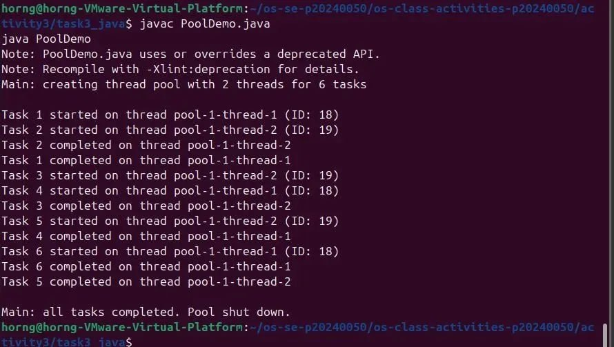
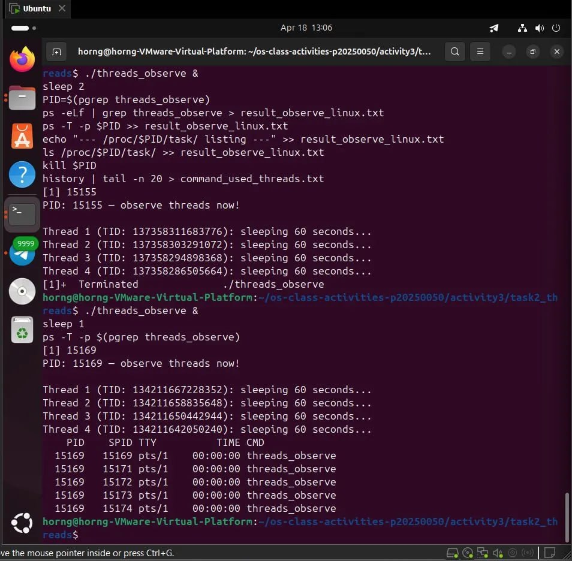
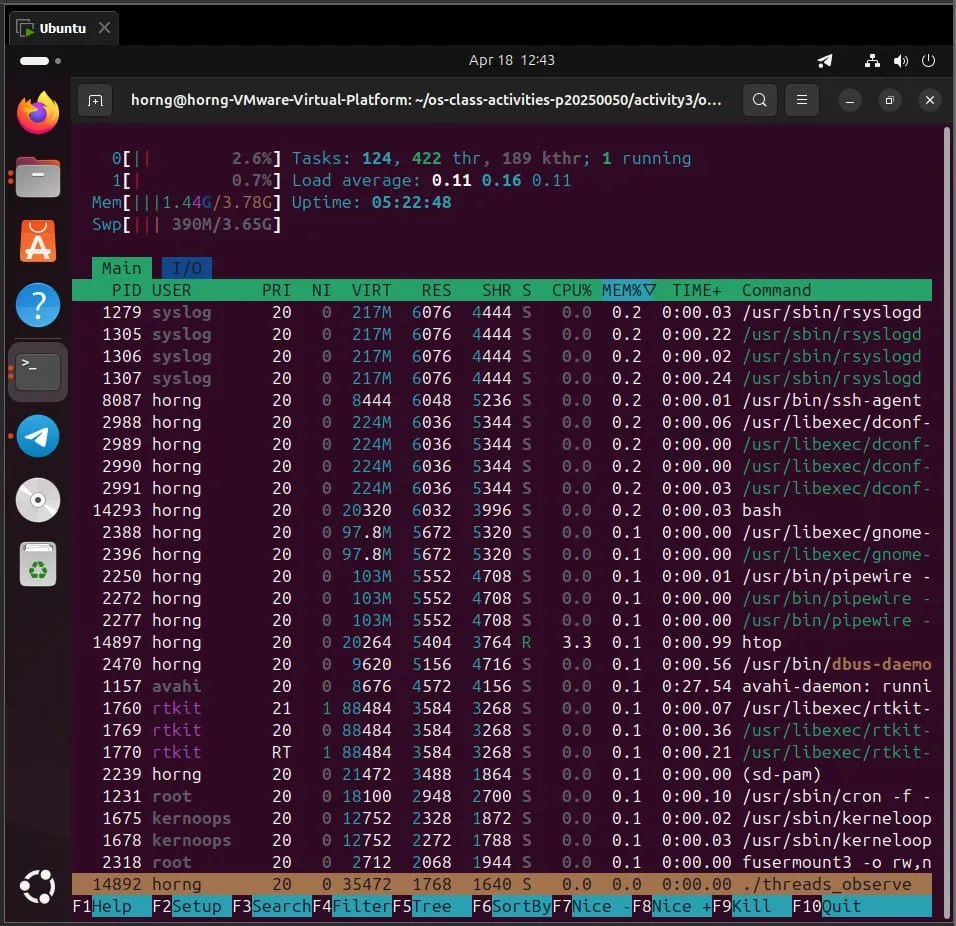
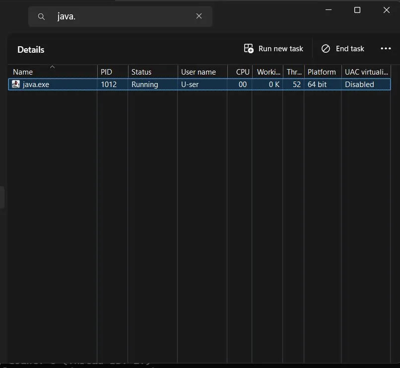

# Class Activity 3 — Socket Communication & Multithreading

- **Student Name:** Chhi Layhorng
- **Student ID:** p20240050
- **Date:** April 18, 2026

---

## Task 1: TCP Socket Communication (C)

### Compilation & Execution



### Answers

1. **Role of `bind()` / Why client doesn't call it:**
   > `bind()` assigns a specific IP address and port to the server socket so that clients know exactly where to connect. The client does not call `bind()` because the operating system automatically assigns it a temporary ephemeral port — the client only needs to know the server's address, not advertise its own.

2. **What `accept()` returns:**
   > `accept()` returns a brand new socket file descriptor different from the original `server_fd`. The original server socket keeps listening for future connections, while the new returned socket `client_fd` is used exclusively to communicate with that one connected client.

3. **Starting client before server:**
   > If you start the client before the server is running, the client immediately gets an error: connect: Connection refused. This happens because no process is listening on port 8080 yet, so the OS rejects the connection attempt instantly.

4. **What `htons()` does:**
   > `htons()` stands for Host TO Network Short. It converts the port number from the host machine's byte order which may be little-endian on x86 CPUs to network byte order which is big-endian. This conversion is required because all network protocols use big-endian byte order, and without it the port number would be interpreted incorrectly on different architectures.

5. **Socket call sequence diagram:**
```
   Server                          Client
   ──────────────────────────────────────────
   socket()                        socket()
   bind()
   listen()
   accept() ◄────── connect() ──────────────
   read()   ◄────── send()   ──────────────
   send()   ──────► read()   ──────────────
   close()                         close()
```

---

## Task 2: POSIX Threads (C)

### Output — Without Mutex (Race Condition)



### Output — With Mutex (Correct)



### Answers

1. **What is a race condition?**
   > A race condition occurs when two or more threads access and modify shared data at the same time and the final result depends on the unpredictable order in which they execute. In threads.c the line shared_counter++ is not atomic — it involves three steps: read the value, add 1, write it back. If two threads read the same value before either writes back, one increment is lost. This is why the counter is different and wrong every time you run it.

2. **What does `pthread_mutex_lock()` do?**
   > `pthread_mutex_lock()` ensures that only one thread can enter the protected critical section at a time. If a thread tries to lock a mutex that is already locked by another thread, it blocks and waits until the mutex is released. This makes the read-modify-write of shared_counter effectively atomic, preventing any lost updates and fixing the race condition.

3. **Removing `pthread_join()`:**
   > If you remove `pthread_join()`, the main thread does not wait for the worker threads to finish. The main thread reaches the end of main() and exits, which terminates the entire process immediately killing all threads before they complete their work. The result is incomplete output and a wrong counter value.

4. **Thread vs Process:**
   > Threads share the same address space as their parent process including code, heap, global variables, and open file descriptors. Each thread has its own private stack, registers, and program counter. A process is a fully isolated execution environment with its own memory space. Threads are lighter to create and communicate more easily via shared memory, but they must use synchronization like mutexes to safely access shared data.

---

## Task 3: Java Multithreading

### ThreadDemo Output


### RunnableDemo Output



### PoolDemo Output



### Answers

1. **Thread vs Runnable:**
   > `extends Thread` makes your class a thread itself — it is simpler to write but limits flexibility because Java does not support multiple inheritance, so your class cannot extend any other class. `implements Runnable` separates the task logic from the thread mechanism which is more flexible and is the preferred approach. With Runnable the same task object can be passed to different threads or an ExecutorService, and your class is still free to extend another class.

2. **Pool size limiting concurrency:**
   > The pool was created with `Executors.newFixedThreadPool(2)` which means only 2 threads exist in the pool at any time. When 6 tasks are submitted only 2 run simultaneously. The remaining 4 tasks wait in an internal queue and are picked up one by one as the running threads finish their current task.

3. **`thread.join()` in Java:**
   > `thread.join()` makes the calling thread which is the main thread pause and wait until the specified thread finishes execution. If you remove join() from ThreadDemo the main thread immediately prints all threads finished while Alpha Beta and Gamma threads are still running and printing their counts — the output will be out of order and the program behaviour becomes unpredictable.

4. **ExecutorService advantages:**
   > ExecutorService reuses a pool of threads instead of creating and destroying a new thread for every task which saves significant CPU and memory overhead. It automatically manages a task queue handles thread lifecycle and provides a clean shutdown() mechanism. For large applications with many short tasks manually creating threads would be wasteful and hard to control — ExecutorService makes this scalable and clean.

---

## Task 4: Observing Threads

### Linux — `ps -T` Output



### Linux — htop Thread View



### Windows — Task Manager



### Answers

1. **LWP column meaning:**
   > LWP stands for Light Weight Process. In Linux threads are implemented as lightweight processes at the kernel level. Each thread gets its own unique LWP ID which is its kernel thread ID, but all threads in the same process share the same PID. In the ps -eLf output you can see multiple rows with the same PID but different LWP values — each row is one thread.

2. **`/proc/<PID>/task/` count:**
   > There are 5 entries in /proc/PID/task/ — one for each of the 4 worker threads created by pthread_create() plus 1 for the main thread itself. This matches exactly the number of threads running in the program which is NUM_THREADS = 4 plus main = 5 total.

3. **Extra Java threads:**
   > Java's JVM automatically creates many internal threads that are invisible to the programmer. These include the Garbage Collector thread, the JIT compiler thread, the Signal Dispatcher thread, the Finalizer thread, and several other JVM housekeeping threads. So even though we only created 3 threads in ThreadDemo, Task Manager shows 52 threads total for java.exe.

4. **Linux vs Windows thread viewing:**
   > Linux provides much more detail. ps -eLf and ps -T show individual thread IDs LWP, CPU time per thread, and state. The /proc/PID/task/ filesystem exposes raw kernel-level thread data. htop with Shift+H shows each thread as a separate line with its own resource usage. Windows Task Manager only shows a total thread count per process — you cannot see individual thread details without using advanced tools like Process Explorer or jstack.

---

## Reflection

> The most interesting part of this activity was seeing the race condition happen in real time — running threads.c multiple times and getting a different wrong counter value each time made it very clear why synchronization is necessary. Understanding threads at the OS level through ps, /proc, and htop helped connect the code I write to what the kernel actually schedules. This knowledge is directly useful when writing concurrent programs because you can see exactly how many threads are running, identify thread leaks, and understand why mutex protection is not optional but essential when threads share data.
