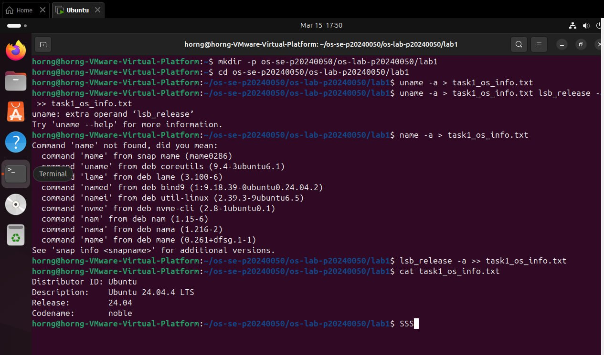
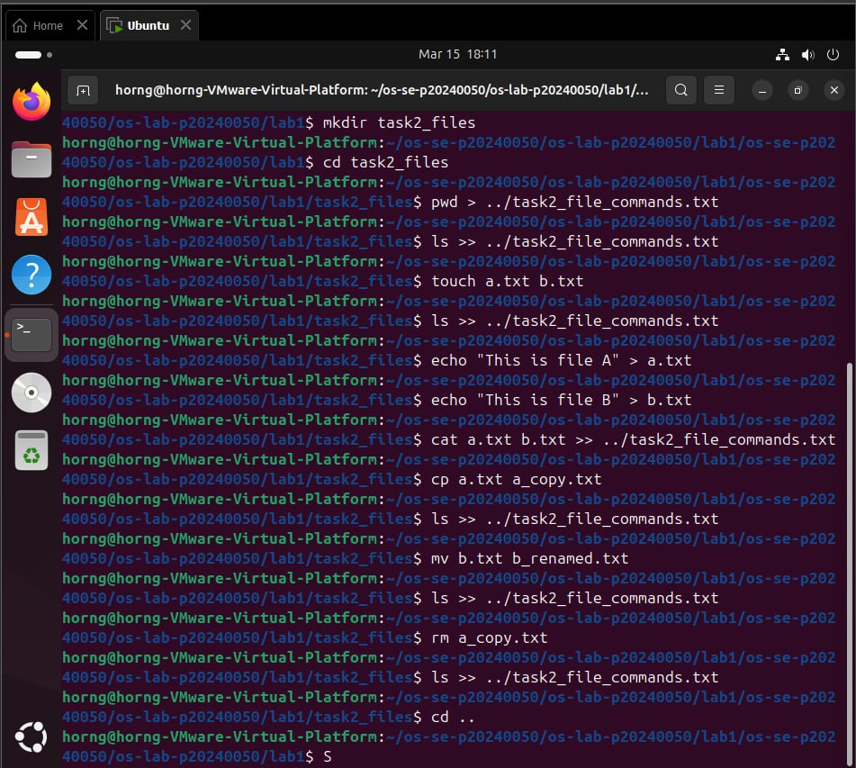
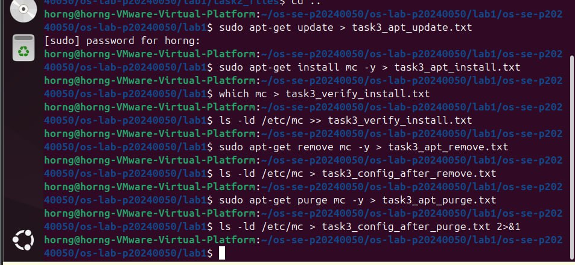
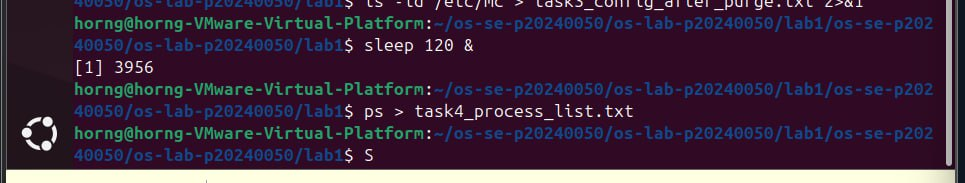
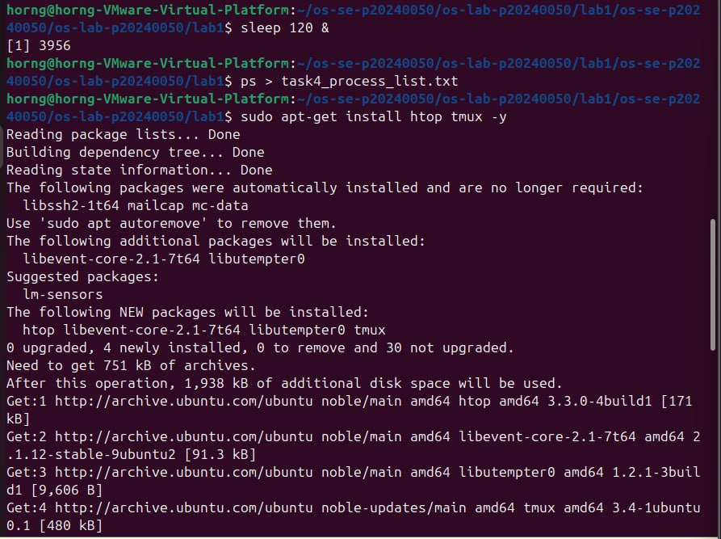
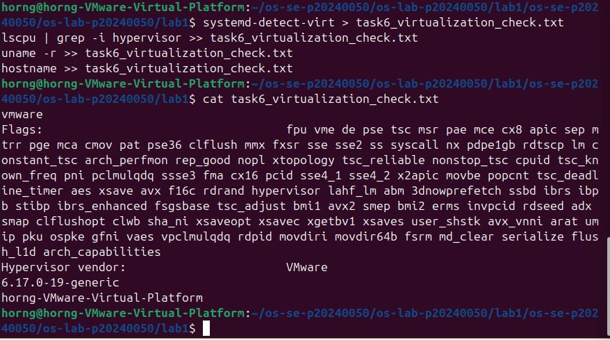

# OS Lab 1 — Exploring Operating System Basics

## Task 1 — OS Identification
- **Commands used:** `uname -a`, `lsb_release -a`
- **Output file:** `task1_os_info.txt`
- **Screenshot:** 

## Task 2 — File and Directory Commands
- **Commands used:** `pwd`, `ls`, `touch`, `echo`, `cat`, `cp`, `mv`, `rm`
- **Output file:** `task2_file_commands.txt`
- **Folder:** `task2_files/`
- **Screenshot:** 

## Task 3 — Package Management (APT)
- **Commands used:** `sudo apt-get update`, `sudo apt-get install mc`, `sudo apt-get remove mc`, `sudo apt-get purge mc`
- **Output files:**  
  `task3_apt_update.txt`  
  `task3_apt_install.txt`  
  `task3_verify_install.txt`  
  `task3_apt_remove.txt`  
  `task3_config_after_remove.txt`  
  `task3_apt_purge.txt`  
  `task3_config_after_purge.txt`
- **Screenshot:** 

## Task 4 — Programs vs Processes
- **Commands used:** `sleep 120 &`, `ps`
- **Output file:** `task4_process_list.txt`
- **Screenshot:** 

## Task 5 — Multitasking
- **Commands used:** `sudo apt-get install htop tmux`, multiple background processes (`sleep 500 &`, `sleep 600 &`, `python3 -m http.server 8080 &`)
- **Output files:** `task5_app_verify.txt`, `task5_multitasking.txt`
- **Screenshots:**  
    
  .jpg)

## Task 6 — Virtualization Detection
- **Commands used:** `systemd-detect-virt`, `lscpu | grep -i hypervisor`, `uname -r`, `hostname`
- **Output file:** `task6_virtualization_check.txt`
- **Screenshot:** 
