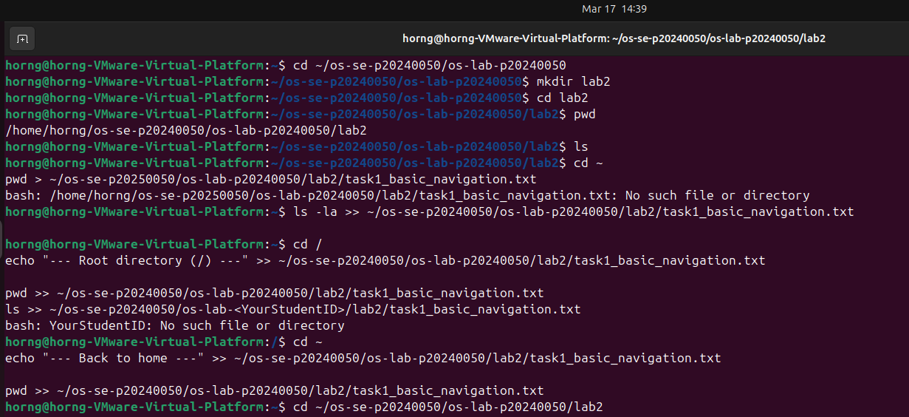
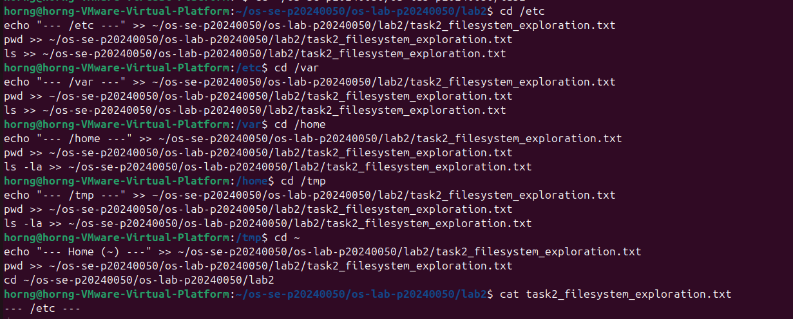
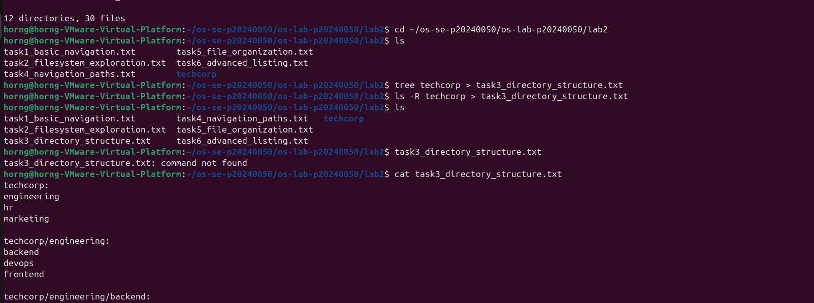
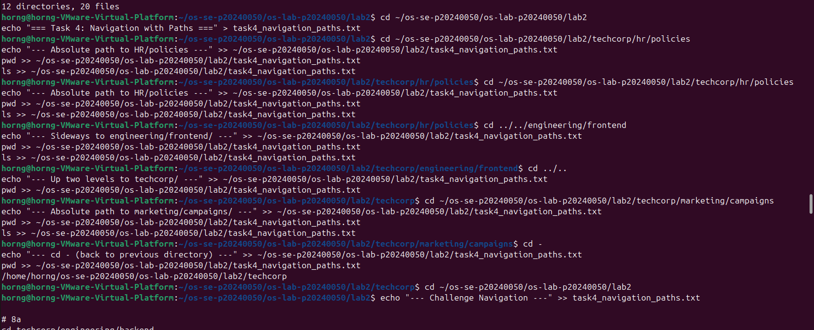
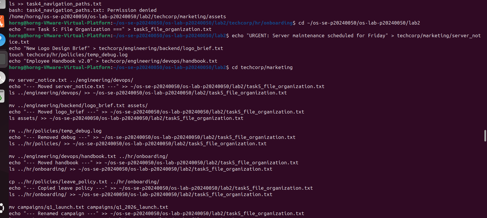
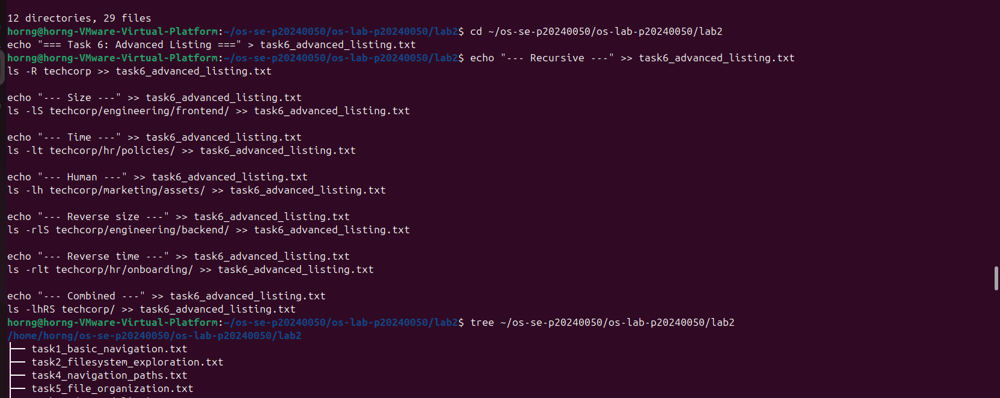

# Lab 2 — Navigation & File Management

## Student Information
- Name: Horng
- Student ID: p20240050

---

## 📌 Task 1 — Basic Navigation
This task demonstrates basic navigation commands in Linux using `cd`, `pwd`, and directory traversal.

📷 Screenshot:

---

## 📌 Task 2 — Filesystem Exploration
Explored important system directories:
- /etc (configuration files)
- /var (logs and cache)
- /home (user directories)
- /tmp (temporary files)

📷 Screenshot:

---

## 📌 Task 3 — Directory Structure
Created a full company structure using `mkdir -p` and populated files using `touch` and `echo`.

📷 Screenshot:

---

## 📌 Task 4 — Navigation Paths
Used:
- Absolute paths
- Relative paths
- `..` (parent)
- `cd -` (previous directory)

📷 Screenshot:

---

## 📌 Task 5 — File Organization
Used commands:
- `cp` (copy)
- `mv` (move/rename)
- `rm` (delete)

Fixed misplaced files across directories.

📷 Screenshot:

---

## 📌 Task 6 — Advanced Listing
Used advanced `ls` commands:
- `ls -R` (recursive)
- `ls -lS` (sort by size)
- `ls -lt` (sort by time)
- `ls -lh` (human-readable)

📷 Screenshot:

---

## ✅ Conclusion
This lab helped understand:
- Linux navigation
- File management
- Directory structure
- System commands
