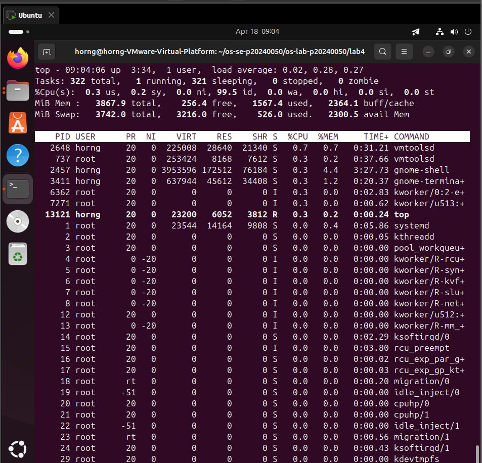
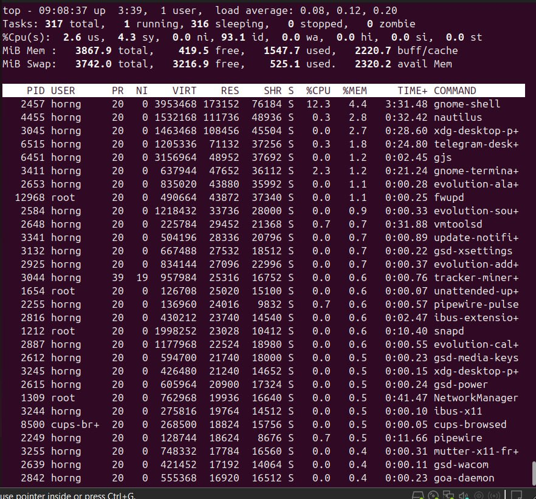
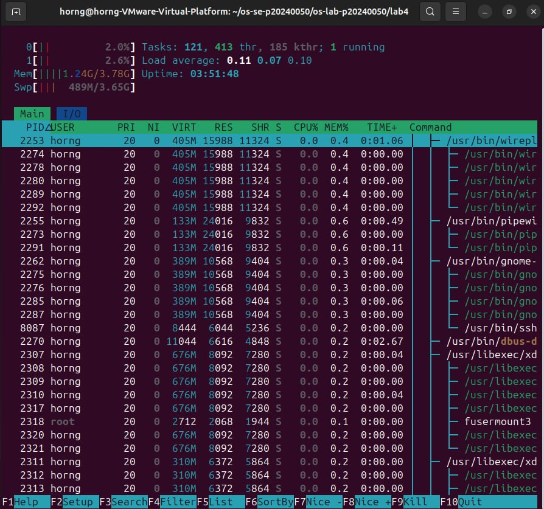
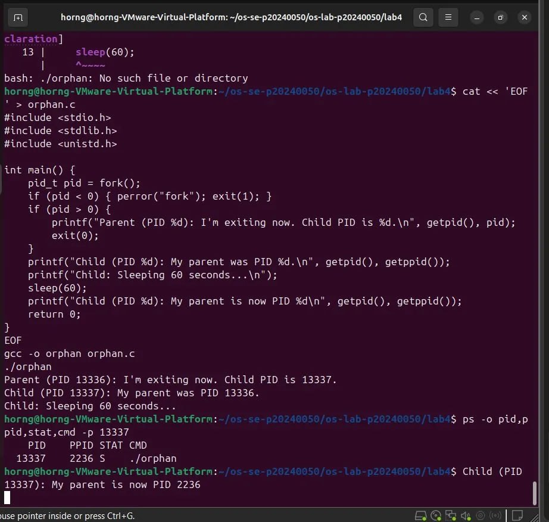
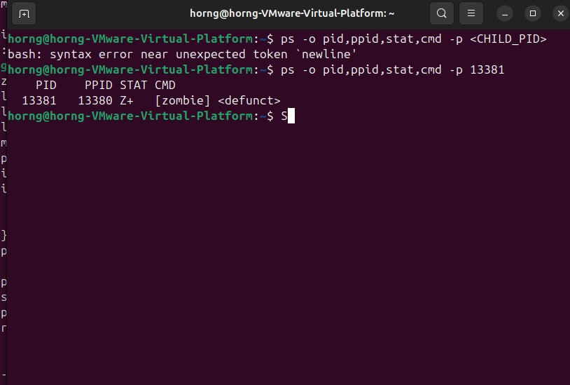
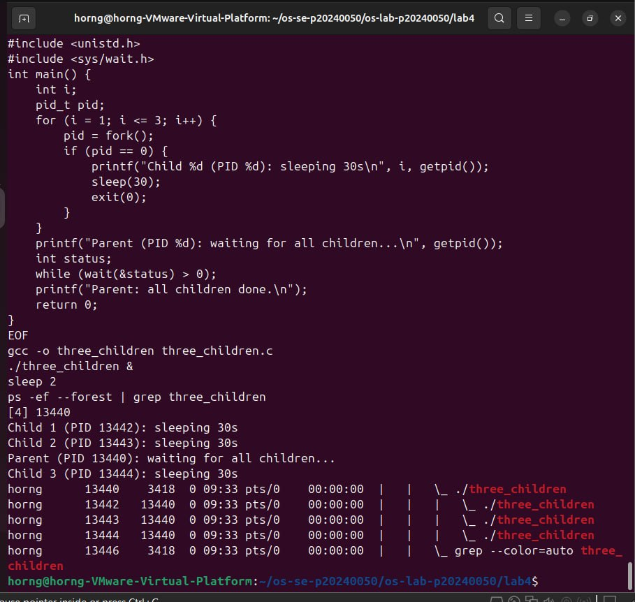
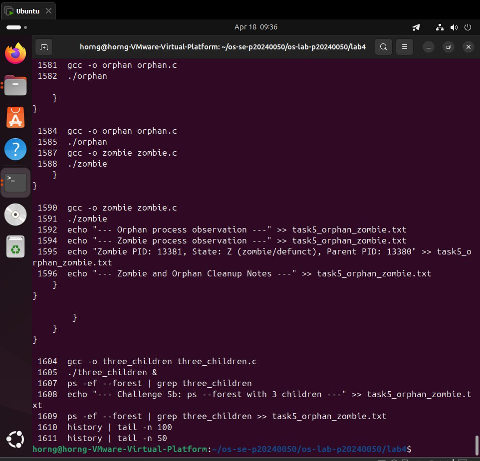

# Lab 4 — I/O Redirection, Pipelines & Process Management

| | |
|---|---|
| **Student Name** | Chhi Layhorng |
| **Student ID** | p20240050 |

## Task Completion

| Task | Output File | Status |
|------|-----------|--------|
| Task 1: I/O Redirection | `task1_redirection.txt` | ☑ |
| Task 2: Pipelines & Filters | `task2_pipelines.txt` | ☑ |
| Task 3: Data Analysis | `task3_analysis.txt` | ☑ |
| Task 4: Process Management | `task4_processes.txt` | ☑ |
| Task 5: Orphan & Zombie | `task5_orphan_zombie.txt` | ☑ |

## Screenshots

### Task 4 — top Output

### Task 4 — top Sorted by Memory

### Task 4 — htop Tree View

### Task 5 — Orphan Process (ps showing PPID = 2236)

### Task 5 — Zombie Process (ps showing state Z)

### Task 5 — Three Children Forest

### History

## Answers to Task 5 Questions

1. **How are orphans cleaned up?**
   > init/systemd (PID 1) adopts the orphan and calls wait() when it finishes.

2. **How are zombies cleaned up?**
   > The parent must call wait() to collect the exit status. If the parent exits, init cleans up the zombie.

3. **Can you kill a zombie with kill -9? Why or why not?**
   > No. A zombie is already dead with no running code to receive signals. Only the parent calling wait() removes it.

## Reflection

> The most useful technique was combining pipes with grep, awk, and sort to analyze log files instantly. In a real server environment, pipelines and redirection save hours of manual work — redirecting errors to separate files and using tee to log while monitoring live output are essential daily tools.
