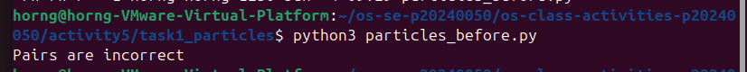
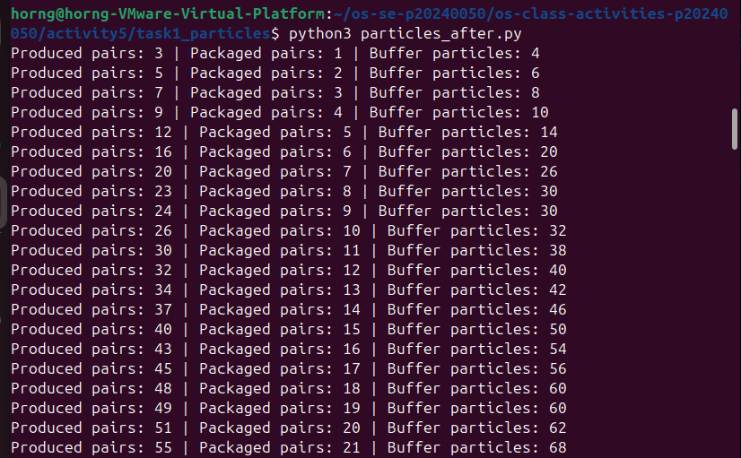
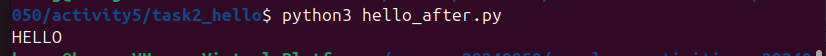

# Class Activity 5 - Semaphores

- **Student Name:** Chhi Layhorng
- **Student ID:** P20240050
- **Programming Language Used:** Python 3

---

## How to Run

Make sure Python 3 is installed. No extra libraries needed — only the built-in `threading` module is used.

```bash
# Task 1A - Particles before semaphores (will break with an error quickly)
python3 task1_particles/particles_before.py

# Task 1B - Particles after semaphores (runs until you press Ctrl+C)
python3 task1_particles/particles_after.py

# Task 2A - HELLO before semaphores (wrong order)
python3 task2_hello/hello_before.py

# Task 2B - HELLO after semaphores (always prints HELLO correctly)
python3 task2_hello/hello_after.py
```

---

## Task 1A: Particle Pair Buffer Before Semaphores



- **What error or incorrect behavior appeared:**  
  The program printed `The packaging machine is broken` almost immediately. The consumer thread checked the buffer length, found it empty, and tried to pop two items before any producer had time to add them.

- **Why did this happen without semaphore protection:**  
  Without a counting semaphore, there is nothing stopping the consumer from running before any items are in the buffer. The consumer simply checks `len(buffer) < 2` — but this check and the actual removal are not atomic. A race condition exists between the moment the check passes and the moment the pop happens. With proper semaphores, the consumer would block at `full_pairs.acquire()` until at least one full pair is available.

---

## Task 1B: Particle Pair Buffer After Semaphores



- **Number of producer machines:** 3
- **Buffer capacity:** 100 particles (50 pairs)
- **Semaphores used:**
  - `empty_pairs` — counting semaphore, initial value 50 (tracks free pair slots)
  - `full_pairs` — counting semaphore, initial value 0 (tracks ready pairs)
  - `mutex` — binary semaphore, initial value 1 (protects the buffer list)
- **Produced pair count shown in screenshot:** (see screenshot)
- **Packaged pair count shown in screenshot:** (see screenshot)
- **Did any error appear during normal operation?** No — the semaphores prevent all three error conditions.

---

## Task 2A: HELLO Before Semaphores


- **Output before semaphore ordering:**  
  Each run printed letters in a different, incorrect order, for example:  
  `LLHOE`, `LHOEL`, `OHELL`, `LOLHE`, `OLLHE`

- **Why this output can be wrong or unpredictable:**  
  The three threads are started at the same time with no coordination. The operating system schedules them independently, so the thread that prints `L` or `O` may be given CPU time before the thread that prints `H`. Small random `time.sleep()` calls were added to make the race more visible, but even without them, the order would not be guaranteed because thread scheduling is non-deterministic.

---

## Task 2B: HELLO After Semaphores



- **Processes or threads used:** 3 threads (Process 1, Process 2, Process 3)
- **Semaphores used:**
  - `start_h = Semaphore(1)` — allows Process 1 to begin immediately
  - `after_e = Semaphore(0)` — blocks Process 2 until Process 1 has printed H and E
  - `after_l1 = Semaphore(0)` — used by Process 2 to sequence its own two L prints
  - `after_l2 = Semaphore(0)` — blocks Process 3 until Process 2 has printed both L's
- **Final output:** `HELLO` (correct on every run)

---

## Questions

**1. In Task 1, why does a producer need to wait before adding a pair to the buffer?**

A producer must wait because the buffer has a fixed capacity of 100 particles (50 pairs). If all 50 pair slots are already full and a producer adds two more particles, the buffer overflows, which corrupts data. The `empty_pairs` semaphore counts how many free pair slots remain. When it reaches zero, the producer blocks until the consumer removes a pair and signals a free slot back.

**2. In Task 1, why does the consumer need to wait before removing a pair from the buffer?**

The consumer must wait because the buffer might be empty. If the consumer tries to pop from an empty list, the program crashes or produces the "packaging machine is broken" error. The `full_pairs` semaphore counts how many complete pairs are currently in the buffer. When it is zero, the consumer blocks until a producer adds a pair and signals that one is ready.

**3. Which semaphore protects the critical section in your particle buffer program?**

The `mutex` semaphore (initial value 1) protects the critical section. Both producers and the consumer call `mutex.acquire()` before touching the shared buffer list and `mutex.release()` after. This ensures only one thread at a time can read or write the buffer, preventing race conditions such as two producers inserting particles at the same time and corrupting pair ordering.

**4. How does your program verify that P1 and P2 belong to the same pair?**

Each particle is named using the format `M{machine_id}-{pair_id}-P1` and `M{machine_id}-{pair_id}-P2` (for example `M2-17-P1` and `M2-17-P2`). When the consumer removes two particles, it extracts the first two parts of the name (machine ID and pair ID) from each particle and compares them:

```python
id1 = "-".join(item1.split("-")[:2])   # "M2-17"
id2 = "-".join(item2.split("-")[:2])   # "M2-17"
if id1 != id2:
    print("Pairs are incorrect")
```

If the IDs do not match (e.g., `M2-17` vs `M4-88`), the program prints `Pairs are incorrect` and stops.

**5. In Task 2, why can the program print letters in the wrong order without semaphores?**

Without semaphores, all three threads are started at the same time and run concurrently. The operating system's thread scheduler decides which thread gets CPU time first, and that decision is not deterministic. Process 2 (which prints L) or Process 3 (which prints O) can be scheduled before Process 1 (which prints H and E), producing output like `OHELL` or `LLHOE`. There is no mechanism to force one thread to wait for another to finish before proceeding.

**6. Which semaphore or synchronization step forces H to print before E, L, L, and O?**

The `start_h` semaphore (initial value 1) allows only Process 1 to start. Processes 2 and 3 are blocked waiting on `after_e` and `after_l2` respectively (both start at 0). Since only Process 1 holds the `start_h` token and it prints H first before printing E and signalling `after_e`, H is guaranteed to be the very first letter printed. E is printed by the same thread immediately after H, before signalling Process 2, so E always follows H.

**7. What could cause deadlock in either of your simulations?**

Several scenarios could cause deadlock:

- **Task 1 — Wrong semaphore order:** If a producer called `mutex.acquire()` before `empty_pairs.acquire()`, and the buffer was full, the producer would hold the mutex while waiting on `empty_pairs`. If the consumer then tried to acquire the mutex (to remove a pair), it would block forever — both are waiting on each other. The correct order is always: acquire counting semaphore first, then acquire mutex.

- **Task 1 — Forgetting to release:** If a thread crashes or returns without calling `mutex.release()`, all other threads waiting on the mutex will block forever.

- **Task 2 — Circular wait:** If Process 2 waited on a semaphore that Process 3 was supposed to signal, and Process 3 waited on a semaphore that Process 2 was supposed to signal, neither would ever proceed. The linear chain design (1 → 2 → 3) avoids circular dependencies.

- **Task 2 — Signalling the wrong semaphore:** If Process 1 signalled `after_l2` instead of `after_e`, Process 3 would run too early (printing O before LL) and Process 2 would wait on `after_e` forever, causing deadlock.

---

## Reflection

These simulations made it clear that semaphores solve two distinct problems.

In Task 1, counting semaphores (`empty_pairs` and `full_pairs`) act like tickets — a producer cannot add to the buffer unless it holds an "empty slot" ticket, and the consumer cannot remove unless it holds a "full pair" ticket. The mutex semaphore ensures that the actual list operations are atomic, so two threads never read or write the buffer at the same time. Without both mechanisms working together, data gets corrupted even if the logic looks correct on paper.

In Task 2, semaphores work differently — not as resource counters, but as signals that enforce execution order. A semaphore initialized to 0 acts as a "gate" that stays locked until another thread unlocks it. This is a simple and reliable way to express "step B cannot happen until step A is done" between independent threads that would otherwise race.

The most important lesson is that a small timing gap between a check and an action (like checking `len(buffer) < 2` and then popping) is enough to cause a crash in a concurrent program. Semaphores close that gap by making the check and the action part of an atomic, coordinated sequence.
