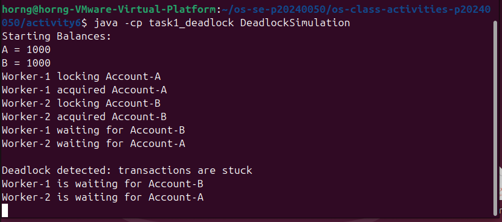
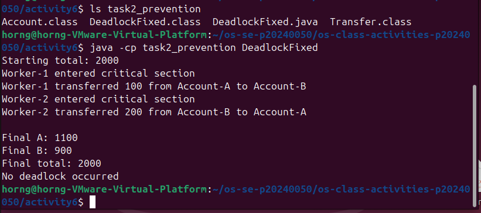

# Class Activity 6 - Deadlock Simulation

* **Student Name:** Chhi Layhorng
* **Student ID:** p20240050
* **Programming Language Used:** Java

---

## Task 1: Deadlock Version

### Shared Resources

* Account A
* Account B

### Transaction 1

Transfer 100 from Account A to Account B.

### Transaction 2

Transfer 200 from Account B to Account A.

### Deadlock Message Shown

Deadlock detected: transactions are stuck

### Explanation of Why the Program Got Stuck

The program deadlocked because both worker threads acquired different account locks and then waited for the lock held by the other thread.

Worker-1 locked Account A and waited for Account B.

Worker-2 locked Account B and waited for Account A.

Since neither thread could continue, both remained blocked forever, creating a circular wait condition. A watchdog timer was added to detect this situation and print a deadlock warning instead of allowing the program to hang silently.

---

## Task 2: Deadlock Prevention Version

### Prevention Strategy Used

A single semaphore mutex initialized to 1 was used to protect the entire transfer operation.

### Semaphore Mutex Initial Value

1

### Starting Total

2000

### Final Total

2000

### Did Both Transfers Complete?

Yes. Both transfer operations completed successfully.

### Why No Deadlock Occurred

Before performing a transfer, each worker thread must acquire the same semaphore mutex. Because the semaphore allows only one thread into the critical section at a time, there is no possibility of two threads holding different resources while waiting for each other. This removes the circular wait situation and prevents deadlock.

---

## Questions

### 1. What are the two shared resources in your bank transaction simulation?

The two shared resources are Account A and Account B.

### 2. Which line or section of your Task 1 program creates hold-and-wait?

The hold-and-wait condition occurs when a thread acquires the source account lock and then waits to acquire the destination account lock.

Example:

from.lock.acquire();

followed by:

to.lock.acquire();

### 3. How does Task 1 create circular wait?

Worker-1 holds Account A and waits for Account B.

Worker-2 holds Account B and waits for Account A.

Each thread is waiting for a resource held by the other thread, forming a circular chain of waiting.

### 4. Why does the Task 1 program need a watchdog or timeout?

Without a watchdog or timeout, the program would remain blocked forever and appear frozen. The watchdog helps identify the deadlock and prints a message explaining that the transactions are stuck.

### 5. How does the single semaphore mutex prevent deadlock in Task 2?

The semaphore mutex allows only one thread to perform a transfer at a time. Since only one thread can enter the critical section, two threads cannot hold resources simultaneously and wait for each other.

### 6. Which of the four deadlock conditions does your Task 2 solution remove or avoid?

The solution prevents the Circular Wait condition.

Because only one thread can enter the critical section at a time, no circular chain of waiting can form.

### 7. Why must the final total bank balance remain unchanged after both transfers?

Money is only transferred between accounts. No money is created or destroyed during the transfers. Therefore, the total balance of all accounts must remain the same before and after execution.

Starting Total = 2000

Final Total = 2000

---

## Reflection

This activity taught me how deadlocks can occur when multiple threads compete for shared resources. By simulating bank transfers, I observed how hold-and-wait and circular wait conditions can cause a system to become stuck indefinitely. I also learned that using a semaphore mutex initialized to 1 can prevent deadlocks by allowing only one thread to access the
