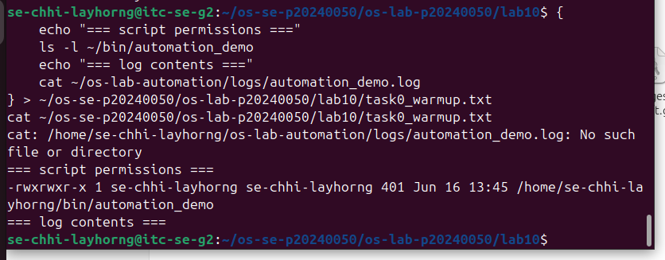
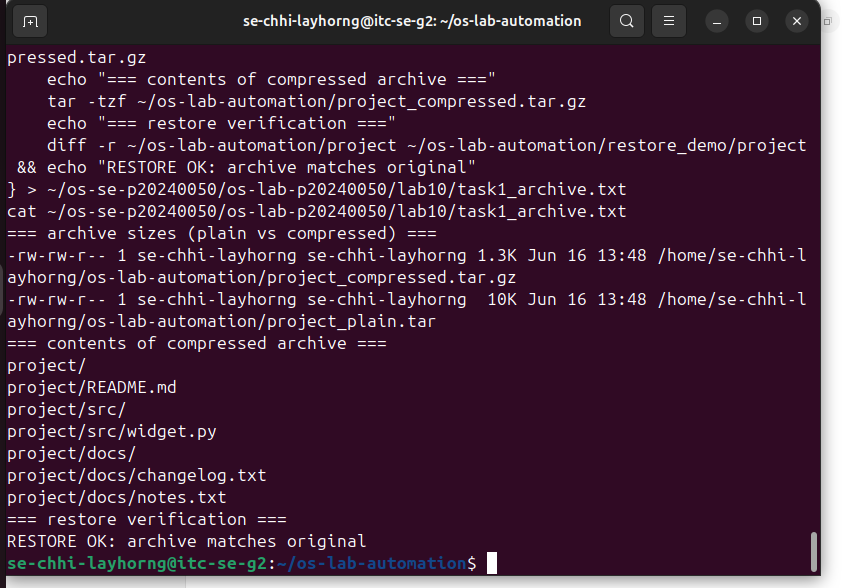
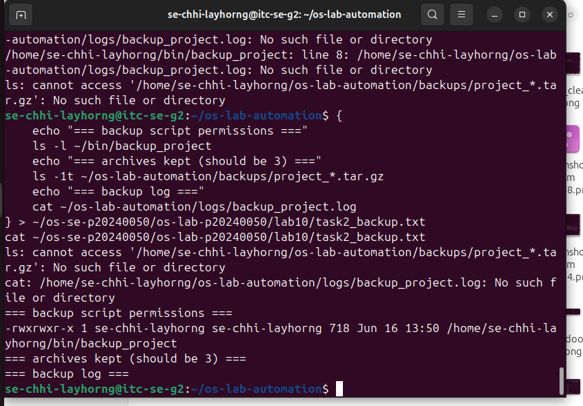
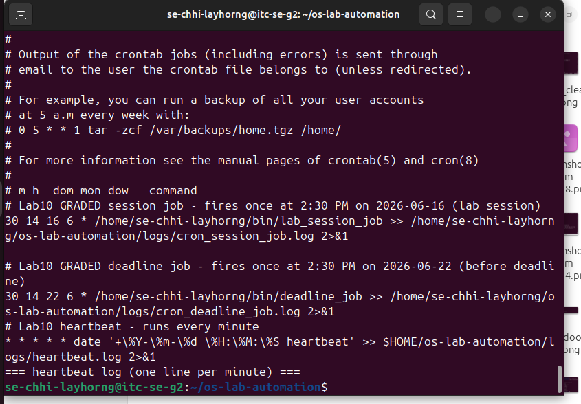
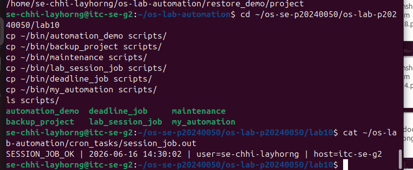
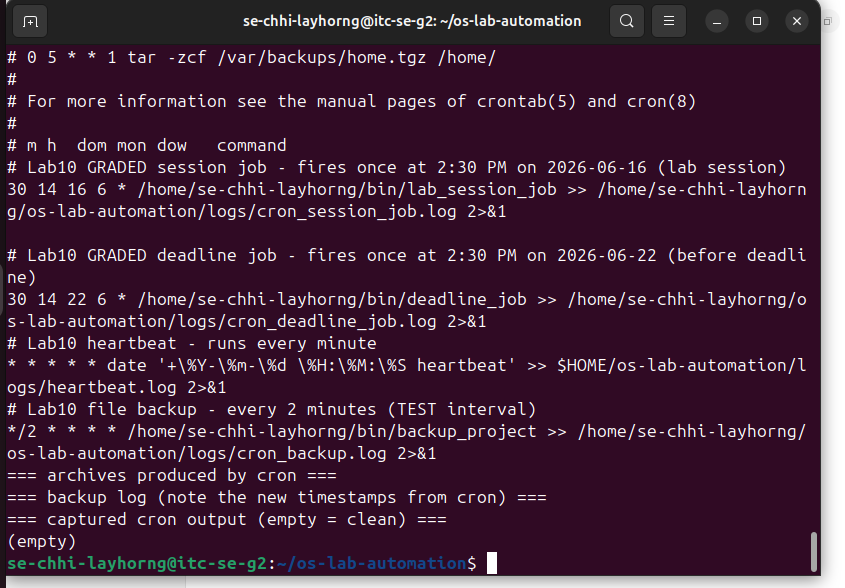
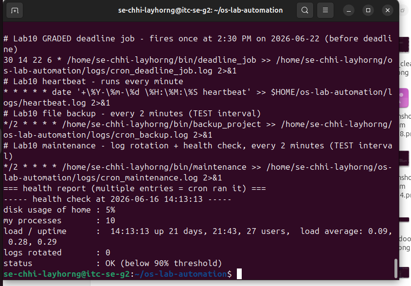
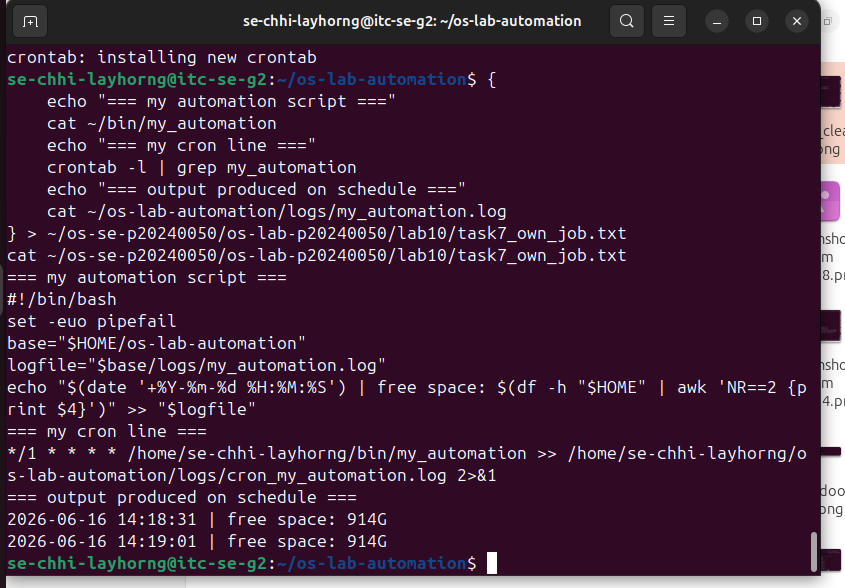
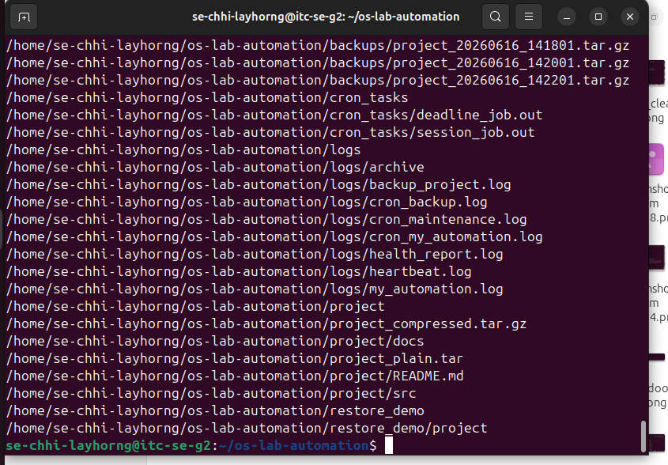

# Lab 10 - Backups, Archiving, Scheduling & cron Automation

**Student ID:** p20240050  
**Username:** se-chhi-layhorng

## Screenshots
- Level 0: 
- Level 1: 
- Level 2: 
- Level 3: 
- Level 4: 
- Level 5: 
- Level 6: 
- Level 7: 
- Level 8: 

## Lab Questions

1. **Archiving vs Compression:** `tar` combines many files into one without shrinking. `gzip` shrinks bytes. Only `gzip` reduces file size.

2. **Size difference:** The `.tar.gz` was much smaller than `.tar` because text files with repeated numbers compress very well.

3. **Absolute path in cron:** cron runs with a minimal environment and does not know about `~/bin`, so full paths like `/home/se-chhi-layhorng/bin/` are required.

4. **% sign and redirection:** `%` has special meaning in crontab (newline), so it must be escaped as `\%`. `>> logfile 2>&1` appends both stdout and stderr to the log file.

5. **Retention logic:** `ls -1t` lists archives newest-first, `tail -n +4` skips the 3 newest and returns the rest for deletion. Keeping only 3 prevents disk from filling up.

6. **Cron line for deadline job:** `30 14 22 6 * /home/se-chhi-layhorng/bin/deadline_job`. Minute=30, Hour=14, Day=22, Month=6 were filled in; day-of-week stayed `*`.

7. **Teardown filter vs crontab -r:** `crontab -r` deletes ALL jobs including the graded deadline job. The filter keeps only the GRADED jobs we still need.

8. **Health check usefulness:** Automated alerts catch disk full or high load before they cause outages, which is critical in real operations.

9. **Level 7 job:** My script logs free disk space every minute. Schedule: `*/1 * * * *` means every 1 minute, any hour, any day, any month, any weekday.
