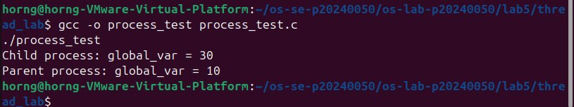
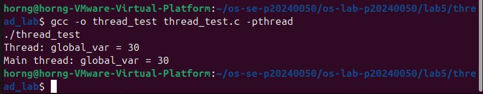
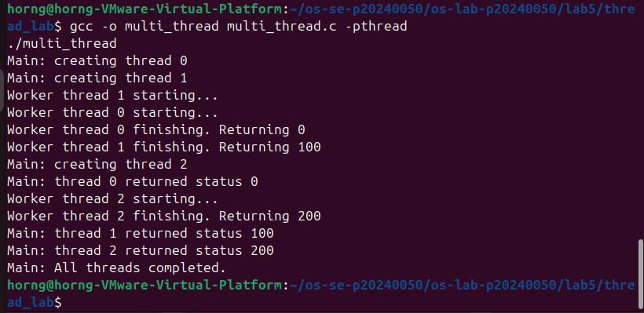
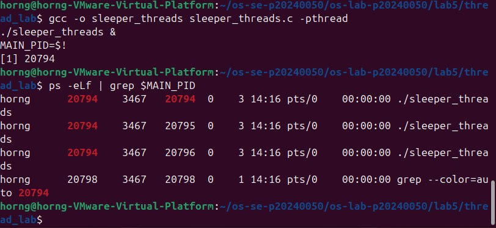
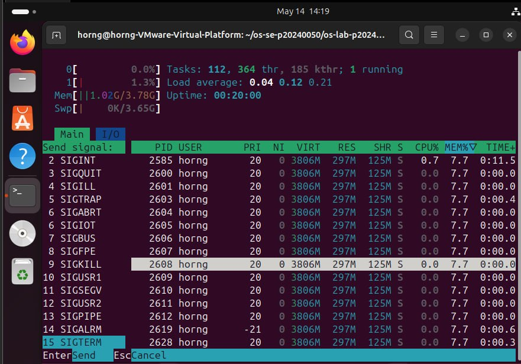
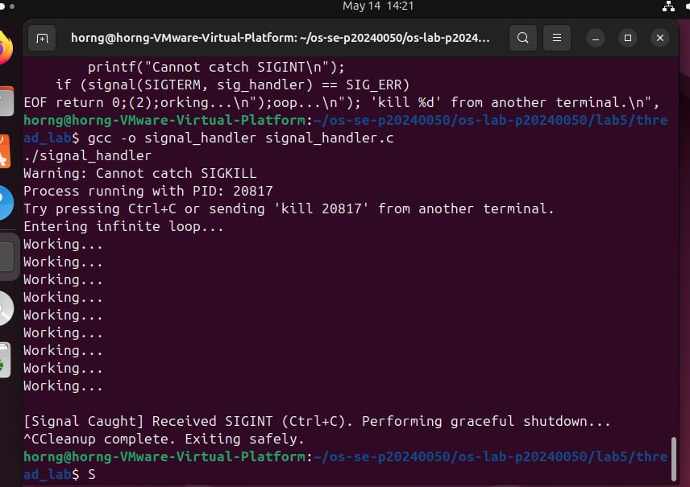
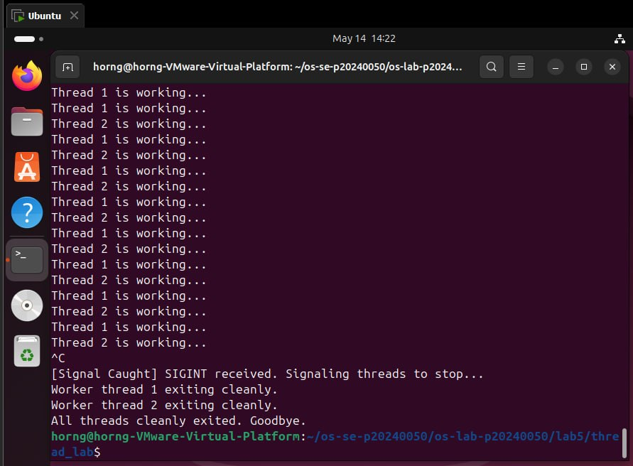

# Lab 5 — Threads, Kernel Workers & Process Signals

| | |
|---|---|
| **Course** | Operating Systems |
| **Student ID** | p20240050 |
| **Date** | 14 May 2026 |

---

## Task 1 — Processes vs Threads

**What it does:** process_test.c uses fork() to show processes have separate memory. thread_test.c uses pthread_create() to show threads share memory.

**Observation:**
- Process: Child sees 30, Parent still sees 10 (separate memory)
- Thread: Thread sets 30, Main also sees 30 (shared memory)

---

## Task 2 — Thread Interaction

**What it does:** Spawns 3 threads each returning tid x 100. Main collects results with pthread_join().

**Observation:** Threads run concurrently and all results are collected safely.

---

## Task 3 — Visualizing Kernel Threads

**What it does:** Uses ps -eLf and /proc/pid/task/ to show 1:1 mapping. htop used to view kernel worker threads.

**Observation:** Same PID appears 3 times with different LWP values. Kernel threads cannot be stopped.

---

## Task 4 — Process Signals

**What it does:** signal_handler.c catches SIGINT and SIGTERM. SIGKILL cannot be caught.

**Observation:** SIGKILL instantly kills with no cleanup. SIGINT and SIGTERM allow graceful exit.

---

## Challenge — Threads and Signals

**What it does:** Spawns 2 threads checking a volatile keep_running flag. Ctrl+C sets flag to 0 and both threads exit cleanly.

**Observation:** Volatile global flag is a safe pattern for graceful thread shutdown.

