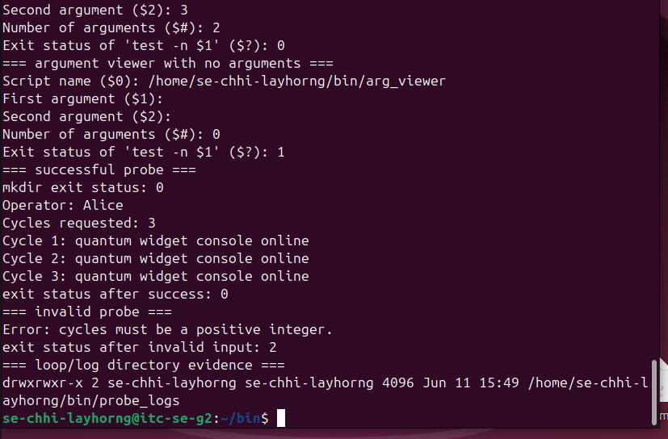
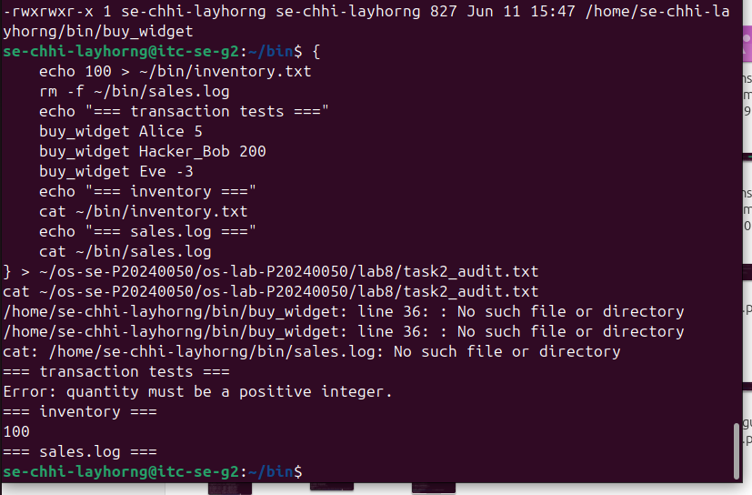
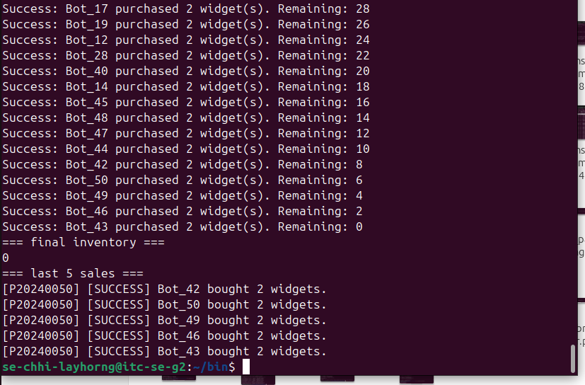
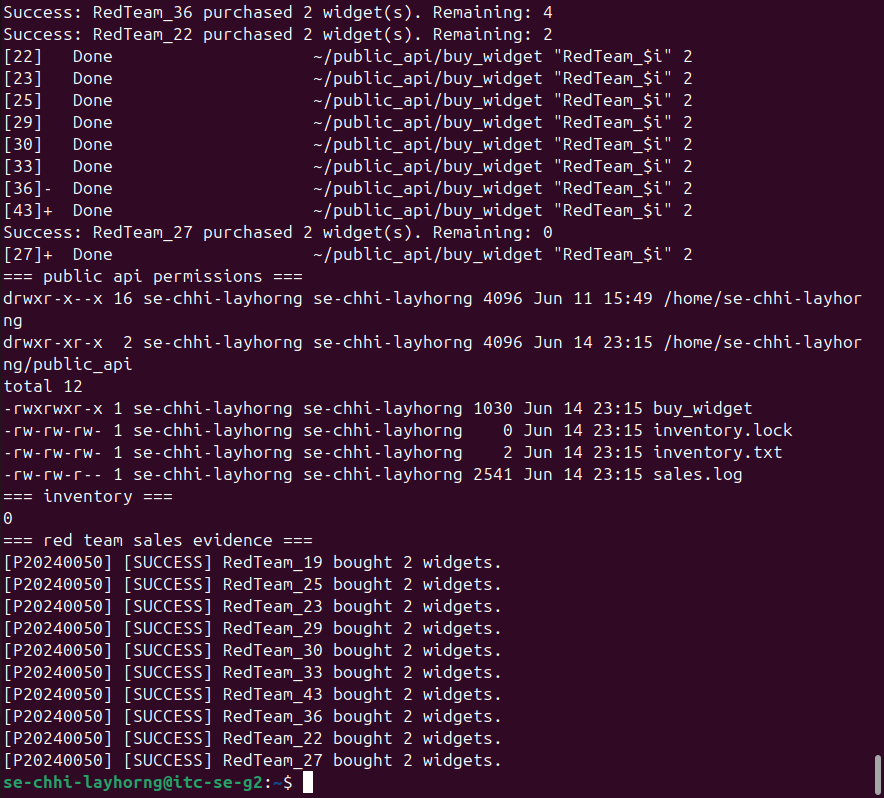
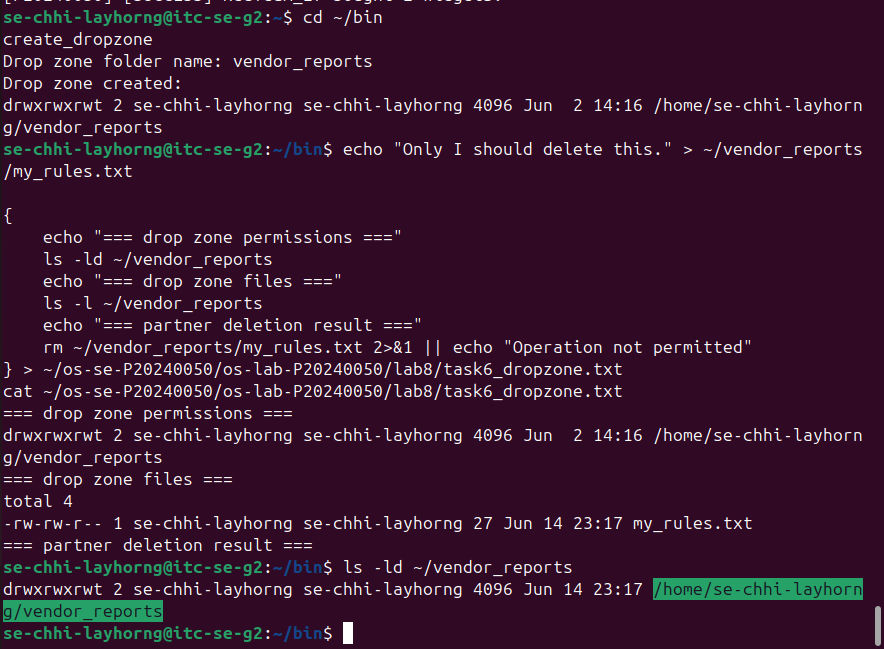
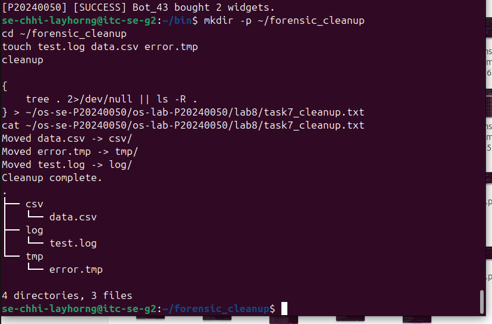

# Lab 8 - Secure Bash Scripting, Race Conditions & File Locking

| | |
|---|---|
| **Student ID** | P20240050 |
| **Username** | se-chhi-layhorng |
| **Course** | Operating Systems |
| **Lab Title** | The Quantum Widget Exploit |

---

## Level 0 – Bash Warm-Up

---

## Level 2 – Audit Trails

---

## Level 4 – Mutex Patch

---

## Level 5 – Red Team vs Blue Team

---

## Level 6 – Secure Drop Zone

---

## Level 7 – Forensic Cleanup

---

## Lab Questions

**1. What does TOC-TOU mean, and where did it appear in the vulnerable buy_widget script?**

TOC-TOU stands for Time-of-Check to Time-of-Use. It is a race condition where the state of a resource changes between the moment it is checked and the moment it is used. In the vulnerable buy_widget, the script read the inventory value from inventory.txt (check), then subtracted the purchase quantity and wrote the new value back (use). Because these two operations are not atomic, multiple concurrent processes could all read the same starting value before any of them had written their result back, causing inventory corruption.

**2. Why did bot_swarm sometimes leave inventory values other than 0 before the patch?**

Without locking, fifty background processes ran concurrently. The OS scheduler interleaved their execution unpredictably. Many processes read the same inventory value before any of them had written an updated value back. As a result, multiple processes each subtracted their quantity from the same stale number and overwrote each other's writes, leaving the inventory much higher than zero.

**3. What part of the script is the critical section, and why must it be protected?**

The critical section is the block that reads inventory.txt, checks whether enough stock is available, calculates the new inventory value, writes that value back, and appends to sales.log. It must be protected because these steps form a single logical operation on shared data. If two processes interleave inside this block, they can both see the same pre-update inventory and write conflicting results.

**4. How does flock -x enforce mutual exclusion between concurrent processes?**

flock -x requests an exclusive lock on a file descriptor attached to a lock file. When one process holds the lock, the OS blocks any other process trying to acquire it. The second process waits until the first releases the lock by exiting the locked subshell, ensuring only one process executes the critical section at a time.

**5. Which permissions did you use to let a classmate run your API without giving full access to your home directory?**

chmod o+x on the home directory grants traversal permission. chmod 755 on public_api makes it readable and executable. chmod o+rx on buy_widget lets others read and execute it. chmod o+rw on inventory.txt, sales.log, and inventory.lock lets the partner process read and write the shared files.

**6. Why does the sticky bit protect files in a shared drop zone?**

With the sticky bit set, the OS only allows a user to delete or rename a file if they own it or own the directory, even if the directory is world-writable. Without it, any user with write permission on the directory could delete files belonging to others.

**7. What defensive scripting practice from this lab would you use in a real production script?**

I would use flock-based mutual exclusion for any script that reads, modifies, and writes a shared file. I would also anchor all file paths using script_dir so the script works correctly regardless of the caller's working directory, and validate all external input with a strict regex before using it in any file operation.
